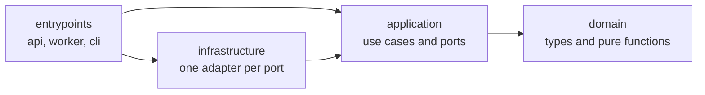
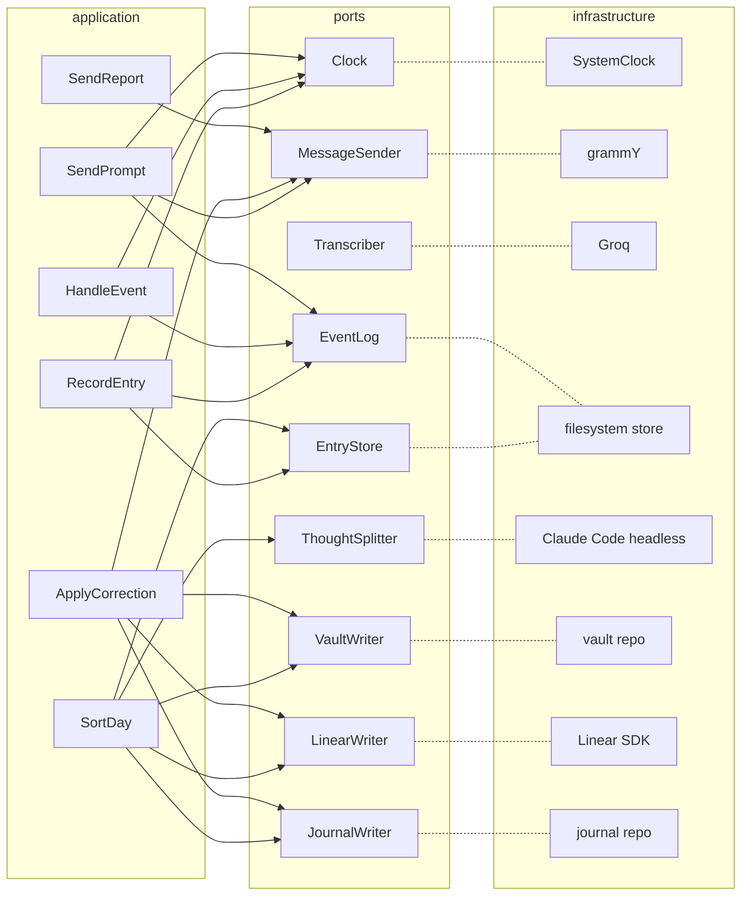
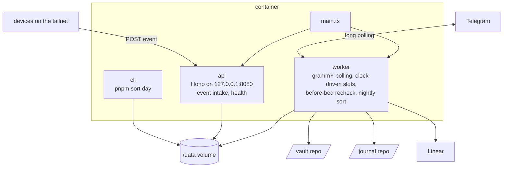
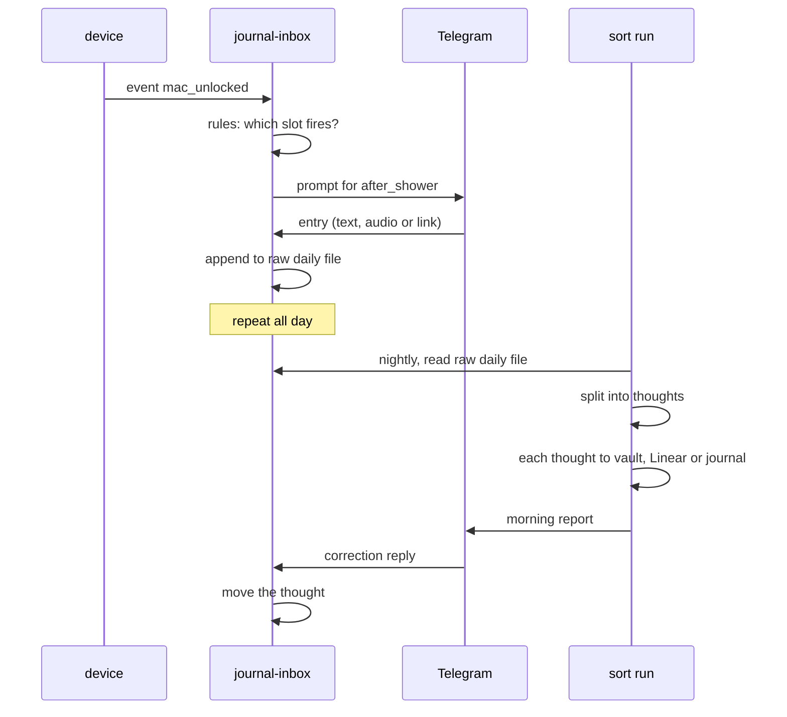

# Architecture

How journal-inbox is built. The vocabulary is in [DOMAIN_LANGUAGE.md](DOMAIN_LANGUAGE.md).

## Layers

Four folders under `src/`. Arrows are imports, and they only point inward. `pnpm lint` fails when one points the other way, and `pnpm build` runs lint first, so the Docker build fails too. The rule is `noRestrictedImports` in the `overrides` of `biome.json`.



| Layer | Holds | May import |
| --- | --- | --- |
| `src/domain` | Entry, Thought, Slot, Rule, Prompt, Day, Pause as plain types, plus pure functions such as "given this event, this day and this time, which slot fires". The prompt table is `SLOTS` in `slot.ts` and `RULES` in `rule.ts`. Day state is a fold over the day's events and is never stored separately. | Nothing. No packages, no Node built-ins. |
| `src/application` | The use cases and the port interfaces they depend on. | Domain. |
| `src/infrastructure` | One adapter per port, plus the env config loader. | Application and domain. |
| `src/entrypoints` | The Hono server, the worker loop and the sort cli. `main.ts` is the only file that knows which adapter fills which port. | Everything. |

## Use cases and ports

Use cases live in application and reach the outside world only through ports. Each port has one adapter in infrastructure, and one fake in `test/harness/fakes.ts`. The acceptance suite runs the use cases against those fakes alone, see [DEVELOPMENT.md](DEVELOPMENT.md). Solid arrows are what a use case depends on. Dotted lines pair a port with its adapter. RecordEntry, HandleEvent and SendPrompt exist. The rest are a reading of the tickets, and the real imports win when they disagree.



All nine ports are in `src/application/ports.ts`.

Telegram is also the way in. `src/infrastructure/telegram/telegram-listener.ts` is not behind a port: it listens for messages with grammY and calls RecordEntry, and the worker starts and stops it. Ports are for what use cases call. The listener calls a use case, like the api does for events.

| Port | What it does |
| --- | --- |
| Clock | Says what time it is. |
| MessageSender | Sends and deletes Telegram messages. |
| Transcriber | Turns an OGG file into a transcript. |
| EntryStore | Appends entries to the raw daily file and reads it back. |
| EventLog | Appends events to the day's log and reads them back. |
| ThoughtSplitter | Splits a raw daily file into thoughts, each with a destination. |
| VaultWriter | Writes a thought to the vault repo. |
| LinearWriter | Writes a thought to Linear. |
| JournalWriter | Writes a thought to the journal repo. |

## One process, three entrypoints

One container, one Node process. `main.ts` wires the adapters and starts the api and the worker. The cli is the same code, run by hand for one day.



## A day, end to end



## Stack

Node 24, TypeScript strict, ESM, pnpm. Node runs the `.ts` files directly in dev, and `tsc` compiles them for production. TypeScript is on 7, the Go compiler.

- grammY with the files plugin for Telegram
- Hono with its Node adapter and zod validator for event intake
- zod at every boundary: event payloads, config, splitter output
- Vitest
- Linear SDK
- Groq over plain fetch
- Claude Code headless mode for the splitter, version pinned by `CLAUDE_CODE_VERSION` in the Dockerfile
- Biome for lint and format. It has its own parser, so it never blocks a TypeScript upgrade.

A package joins `package.json` in the ticket that first uses it.

## Storage

Plain files in a Docker volume, no database.

```
/data
  pause.json            outlives a day, so it sits outside the day folders
  2026-09-17/           one folder per Singapore day
    entries.md          the raw daily file
    events.jsonl        append-only, one JSON object per line
    audio/              OGG files
    sort.json           the sort record, written by the sort run
```

`entries.md` is the permanent record and is only ever appended to. Each entry is a heading with the Singapore wall-clock time it arrived and, once prompts land, the slot it answers, then the message.

```
## 09:20

standup went long again

## 21:05 · after_shower

Never Gonna Give You Up
https://youtu.be/dQw4w9WgXcQ
```

The bot logs its own actions, such as entry recorded, prompt sent and prompt deleted, as events too. A restart loses nothing because day state is rebuilt from the log. SQLite is the upgrade path if cross-day queries get painful, and only infrastructure would change.

## Assumptions

Written down so we notice when one breaks.

- One user, ever. No auth beyond the owner's Telegram id and one shared secret on event intake.
- Singapore time is the day boundary, even in Malaysia.
- The server is up whenever a prompt should fire. If it is down, prompts are lost, not queued.
- Events arrive at most a few per minute. No queue, no backpressure.
- The vault README conventions stay as they are today.
- Groq's free tier stays free, and a voice note never exceeds Telegram's 20 MB download cap.
- The LLM decides routing. We correct it, we don't hand-write routing rules.
- A logged-in Claude Code CLI on the server is an acceptable way to run the splitter on the existing subscription.
